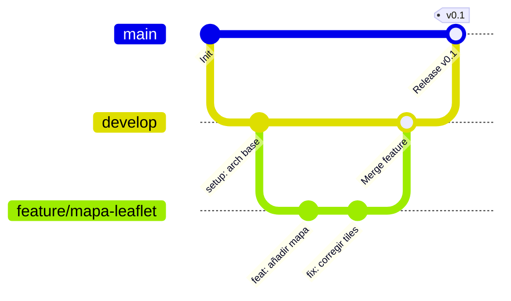

# Metodología de Trabajo y Control de Versiones

## 1. Gestión del Proyecto (ZenHub y Clockify)

Para garantizar un desarrollo ordenado y medir el esfuerzo técnico, el ciclo de vida del proyecto implementa una metodología ágil adaptada a un contexto individual, combinando el flujo continuo de Kanban con el control métrico de tiempo.

* **Tablero Kanban (ZenHub):** Todo el trabajo se estructura en *Issues* asociadas al repositorio de GitHub. El flujo de estados será estricto para mantener el orden:

  * `New Issues`: Bandeja de entrada para ideas, posibles errores o requisitos sin detallar.
  * `To Do`: Tareas desglosadas, estimadas y priorizadas, listas para ser abordadas.
  * `In Progress`: Trabajo en curso. Se aplicará un límite estricto de *Work In Progress* (máximo 1 o 2 tareas simultáneas) para evitar cuellos de botella.
  * `Review/Testing`: Fase local de control de calidad (ejecución de pruebas, validación de consultas PostGIS y revisión de código).
  * `Done`: Tareas finalizadas cuyo código ya está fusionado (*merged*) y validado.

* **Registro de Tiempos (Clockify):** El desarrollo se enmarca en un límite estricto de **300 horas** requeridas para el TFG. Cada bloque de trabajo debe registrarse bajo el proyecto principal indicando la fase del ciclo de vida y utilizando etiquetas taxonómicas precisas:
  * `Investigación`: Análisis de APIs, lectura de documentación o pruebas de viabilidad.
  * `Desarrollo`: Escritura activa de código (Frontend, Backend, Base de Datos).
  * `Pruebas`: Ejecución de test unitarios, auditorías de interfaz y depuración.
  * `Documentación`: Redacción de actas, requisitos y la memoria final del TFG.

---

## 2. Estrategia de Ramas (Gitflow simplificado)

Se utilizará un modelo de ramificación adaptado para un único desarrollador. Esto garantiza que el repositorio esté siempre en un estado funcional sin la sobrecarga de gestionar múltiples entornos simultáneos:

* **`main` (Producción):** Contiene únicamente código estable, funcional y evaluable (versiones de entrega). **Nunca se programa directamente sobre esta rama.** Solo recibe actualizaciones mediante fusiones controladas cuando se alcanza un hito (ej. MVP o Entrega Final).
* **`develop` (Integración):** Rama base de desarrollo continuo. Actúa como el tronco activo donde convergen todas las funcionalidades terminadas antes de pasar a `main`.
* **`feature/<nombre-funcionalidad>` (Aislamiento):** Ramas efímeras creadas a partir de `develop` para aislar el desarrollo de tareas específicas (ej. `feature/mapa-leaflet`, `feature/auth-jwt`). Al terminar y verificar el código, se fusionan (*merge*) con `develop` y se eliminan.

### Diagrama de Flujo del Repositorio



### Protocolo de Trabajo en Consola (Paso a Paso)

Para ilustrar el flujo de trabajo diario, este es el proceso exacto en terminal para desarrollar una funcionalidad nueva:

**1. Sincronizar y crear la rama de trabajo:**
```bash
git checkout develop
git pull origin develop
git checkout -b feature/auth-jwt
```

**2. Desarrollar, revisar estado y empaquetar cambios:**
```bash
git status
git add .
git commit -m "feat(auth): implementar middleware de verificacion JWT"
```

**3. Fusionar con develop y limpiar:**
```bash
git push origin feature/auth-jwt
git checkout develop
git merge --no-ff feature/auth-jwt -m "merge: integrar auth-jwt en develop"
git push origin develop
git branch -d feature/auth-jwt
```

---

## 3. Convención de Commits (Conventional Commits)

Todos los mensajes de commit seguirán la especificación formal de la industria (*Conventional Commits*) para generar trazabilidad automática y mantener un historial semántico. La estructura será: `<tipo>(<ámbito opcional>): <descripción breve>`.

* **`feat:`** Nueva funcionalidad o característica. *(Ej: `feat(api): crear endpoint para listar incendios activos`)*
* **`fix:`** Resolución de un error o bug. *(Ej: `fix(mapa): corregir solapamiento de poligonos`)*
* **`docs:`** Cambios exclusivos en documentación o archivos Markdown. *(Ej: `docs: actualizar readme con comandos de docker`)*
* **`style:`** Cambios de formato (espacios, comas, indentación) que no afectan a la lógica. *(Ej: `style: formatear componentes con prettier`)*
* **`refactor:`** Refactorización de código que no arregla un error ni añade funcionalidad (mejora interna). *(Ej: `refactor(db): extraer logica de conexion a un servicio independiente`)*
* **`test:`** Adición o corrección de pruebas automatizadas. *(Ej: `test: verificar que el JWT caduca en 24h`)*
* **`chore:`** Actualización de dependencias, configuración del entorno (ej. Docker) o tareas rutinarias. *(Ej: `chore: actualizar typescript a v5.0`)*

---

## 4. Política de Autoría y Simplificación en Commits

> **Justificación Metodológica para la Memoria del TFG:**
>
> En entornos corporativos con múltiples programadores, es habitual incluir identificadores de coautoría o firmas explícitas dentro del mensaje del commit (como `Co-authored-by:` o firmas GPG) para auditar responsabilidades.
>
> Sin embargo, al tratarse de un Trabajo Fin de Grado desarrollado de manera íntegra por un único autor, **se ha tomado la decisión técnica de omitir cualquier identificación nominal manual dentro del texto de los commits**. 
>
> Esta decisión se fundamenta en:
> 1. **Agilidad y Velocidad:** Evita fricción y escritura repetitiva durante las fases de programación intensiva.
> 2. **Redundancia Nula:** La autoría ya queda criptográficamente registrada y demostrada a través de las variables globales del entorno Git (`user.name` y `user.email`).
> 3. **Limpieza del Historial:** Permite que los mensajes se centren de forma exclusiva en el *qué* y el *por qué* del cambio (Conventional Commits), delegando el *quién* a los metadatos nativos del sistema de control de versiones.